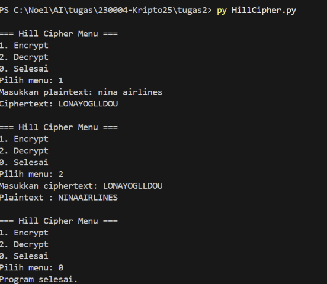

# Hill Cipher Program (Python)

Program ini mengimplementasikan algoritma **Hill Cipher** untuk proses enkripsi dan dekripsi teks dengan kunci matriks.  
Dibuat menggunakan bahasa Python dan library **NumPy** untuk perhitungan matriks.

---

## 📌 Cara Kerja Program

### 1. Fungsi Utama
- **`mod_inv(a, m)`**  
  Mencari invers modulo. Digunakan untuk menemukan determinan inverse saat proses dekripsi.
  
- **`text_to_numbers(text)`**  
  Mengubah teks menjadi angka (A=0, B=1, …, Z=25).

- **`numbers_to_text(nums)`**  
  Mengubah angka kembali menjadi teks.

- **`chunk_text(text, size)`**  
  Membagi teks ke dalam blok sesuai ukuran matriks kunci. Jika panjang teks tidak sesuai, otomatis ditambah huruf `A` (0).

- **`hill_encrypt(plaintext, key_matrix)`**  
  Melakukan enkripsi:  
  \[
  C = (K \times P) \mod 26
  \]  
  - `K` = matriks kunci  
  - `P` = blok plaintext

- **`hill_decrypt(ciphertext, key_matrix)`**  
  Melakukan dekripsi:  
  \[
  P = (K^{-1} \times C) \mod 26
  \]  
  Di sini `K⁻¹` dihitung dari determinan invers dan matriks adjoint.

---

### 2. Flow Program
1. User diberikan menu:
   - **Encrypt** → input plaintext → hasil ciphertext  
   - **Decrypt** → input ciphertext → hasil plaintext  
   - **Selesai** → keluar dari program  

2. Default key yang digunakan:
   ```python
   key = np.array([[3, 3],
                   [2, 5]])

3. Program berjalan dalam loop hingga user memilih opsi 0.

## 📌 Contoh Penggunaan
### Enkripsi
=== Hill Cipher Menu ===
1. Encrypt
2. Decrypt
0. Selesai
Pilih menu: 1
Masukkan plaintext: nina airlines
Ciphertext: LONAYOGLLDOU

### Dekripsi
=== Hill Cipher Menu ===
1. Encrypt
2. Decrypt
0. Selesai
Pilih menu: 2
Masukkan ciphertext: LONAYOGLLDOU
Plaintext : NINAAIRLINES
