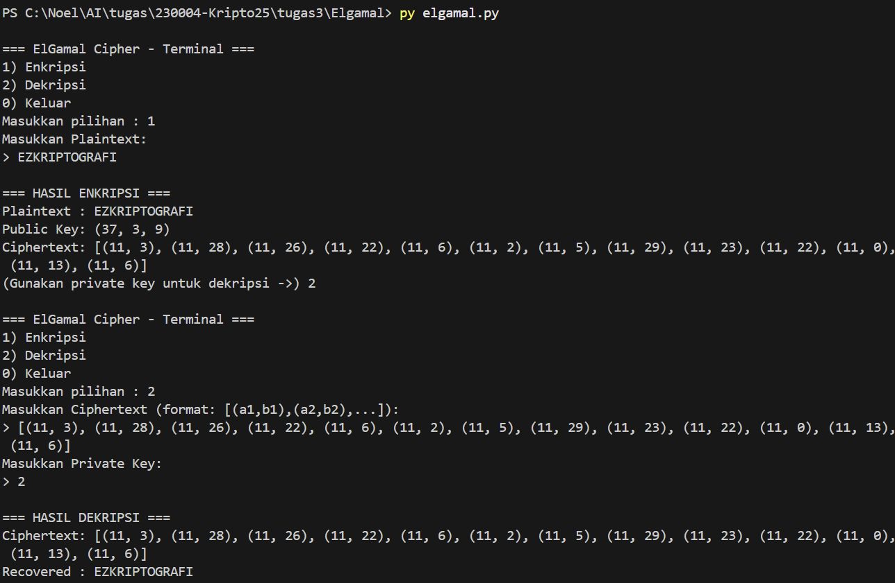

# ElGamal Cipher

Program ini adalah implementasi sederhana dari algoritma **ElGamal** dalam Python.  
Dapat digunakan untuk **enkripsi** dan **dekripsi** pesan teks (huruf A–Z).

---

## 📌 Cara Kerja Program
1. User memilih menu:
   - **1) Enkripsi**
     - Masukkan plaintext (hanya huruf, otomatis dibersihkan).
     - Program menghasilkan ciphertext dalam bentuk pasangan `(a, b)` untuk setiap karakter.
     - Public key dan private key ditampilkan.
   - **2) Dekripsi**
     - Masukkan ciphertext yang berbentuk list Python `[(a1,b1),(a2,b2),...]`.
     - Masukkan private key.
     - Program akan memulihkan plaintext.
   - **0) Keluar**

2. Cipher hanya mendukung huruf alfabet **A–Z**.  
   Karakter non-alfabet akan diabaikan.

---

## 📂 Struktur File
- `elgamal.py` → kode utama ElGamal (terminal version).

---

## ▶️ Cara Menjalankan
```bash
python elgamal.py
```

### Contoh Enkripsi
```
=== ElGamal Cipher - Terminal ===
1) Enkripsi
2) Dekripsi
0) Keluar
Masukkan pilihan : 1
Masukkan Plaintext:
> EZKRIPTOGRAFI

=== HASIL ENKRIPSI ===
Plaintext : EZKRIPTOGRAFI
Public Key: (37, 3, 9)
Ciphertext: [(11, 8), (11, 24), (11, 4), (11, 26), (11, 1), (11, 9), (11, 7), (11, 17), (11, 24), (11, 16), (11, 13), (11, 7), (11, 8)]
(Gunakan private key untuk dekripsi ->) 2
```

### Contoh Dekripsi
```
=== ElGamal Cipher - Terminal ===
1) Enkripsi
2) Dekripsi
0) Keluar
Masukkan pilihan : 2
Masukkan Ciphertext (format: [(a1,b1),(a2,b2),...]):
> [(11, 8), (11, 24), (11, 4), (11, 26), (11, 1), (11, 9), (11, 7), (11, 17), (11, 24), (11, 16), (11, 13), (11, 7), (11, 8)]
Masukkan Private Key:
> 2

=== HASIL DEKRIPSI ===
Ciphertext: [(11, 8), (11, 24), (11, 4), (11, 26), (11, 1), (11, 9), (11, 7), (11, 17), (11, 24), (11, 16), (11, 13), (11, 7), (11, 8)]
Recovered : EZKRIPTOGRAFI
```

---

## ⚙️ Fungsi Utama
- `mod_exp(base, exp, mod)` → eksponensiasi modular.  
- `mod_inv(a, m)` → mencari invers modular.  
- `letter_to_num(c)` → ubah huruf ke angka (A=0, B=1, ..., Z=25).  
- `num_to_letter(n)` → ubah angka ke huruf.  
- `generate_keys(p, g)` → buat public key & private key.  
- `encrypt(message, public_key, k)` → enkripsi teks.  
- `decrypt(ciphertext, private_key, p)` → dekripsi ciphertext.

---

## 📖 Catatan
- Program ini **hanya untuk tujuan edukasi**.  
- Tidak aman untuk digunakan dalam sistem nyata.  
- Nilai `p = 37`, `g = 3`, `x = 2`, dan `k = 15` dipilih agar perhitungan sederhana.
