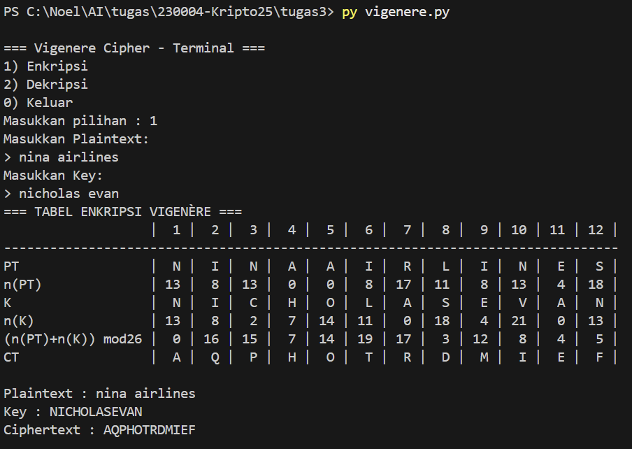
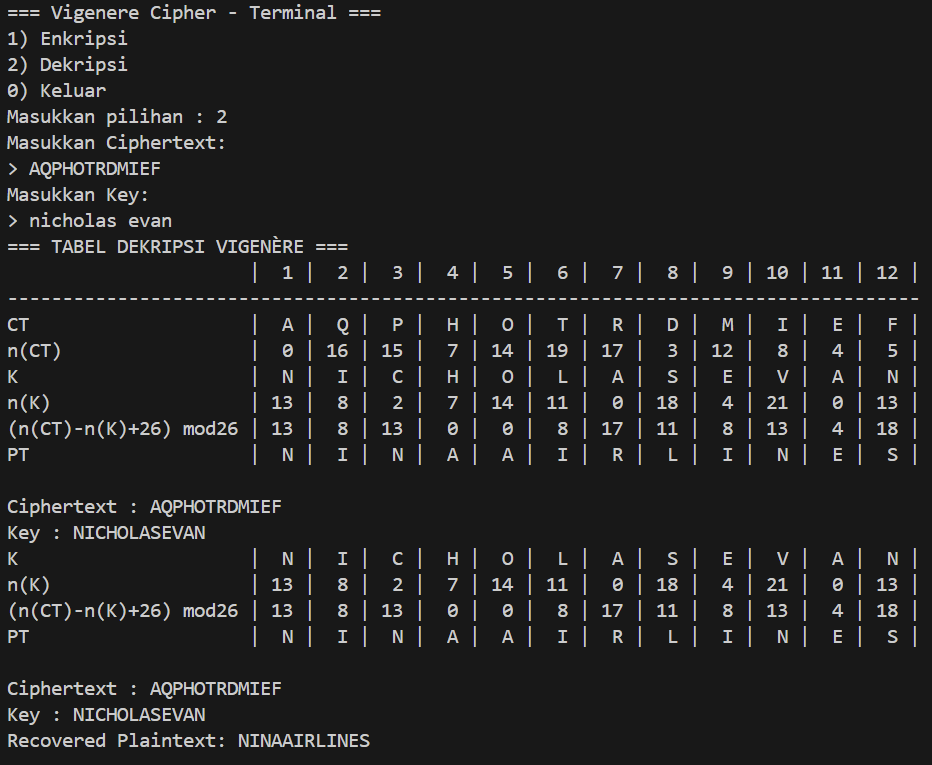
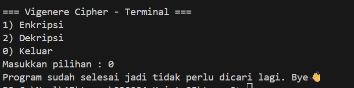

# Vigenère Cipher

Program ini mengimplementasikan algoritma **Vigenère Cipher** untuk proses enkripsi dan dekripsi teks dengan kunci berbentuk string.  
Dibuat menggunakan bahasa Python standar, **tanpa library eksternal**.

---

## 📌 Cara Kerja Program

### 1. Fungsi Utama
- **`sanitize(text)`**  
  Membersihkan teks agar hanya huruf A–Z (uppercase), mengabaikan spasi/punctuation.

- **`letter_to_num(c)` / `num_to_letter(n)`**  
  Konversi huruf ke angka (A=0, B=1, …, Z=25) dan sebaliknya.

- **`repeat_key(key, length)`**  
  Mengulang key agar panjangnya sama dengan plaintext/ciphertext.

- **`encrypt_vigenere(plaintext, key)`**  
  Melakukan enkripsi dengan rumus:  
  Cᵢ = (Pᵢ + Kᵢ) mod 26

- **`decrypt_vigenere(ciphertext, key)`**  
  Melakukan dekripsi dengan rumus:  
  Pᵢ = (Cᵢ - Kᵢ + 26) mod 26

Program menampilkan **tabel enkripsi & dekripsi** berisi langkah per huruf.

---

### 2. Flow Program
1. User diberikan menu utama:
   - **1) Enkripsi** → input plaintext dan key → menghasilkan ciphertext serta tabel proses.  
   - **2) Dekripsi** → input ciphertext dan key → menghasilkan plaintext serta tabel proses.  
   - **0) Keluar** → menghentikan program.

2. Program berjalan dalam loop sampai user memilih opsi **0**.

---

## 📌 Contoh Penggunaan

### Enkripsi
```
=== Vigenere Cipher - Terminal ===
1) Enkripsi
2) Dekripsi
0) Keluar
Masukkan pilihan : 1
Masukkan Plaintext:
> NINAAIRLINES
Masukkan Key:
> NICHOLASEVAN

Plaintext : NINAAIRLINES
Key : NICHOLASEVAN
Ciphertext : AQPHOTRDMIEF
```

### Dekripsi
```
=== Vigenere Cipher - Terminal ===
1) Enkripsi
2) Dekripsi
0) Keluar
Masukkan pilihan : 2
Masukkan Ciphertext:
> AQPHOTRDMIEF
Masukkan Key:
> NICHOLASEVAN

Ciphertext : AQPHOTRDMIEF
Key : NICHOLASEVAN
Recovered Plaintext: NINAAIRLINES
```

---

## 📌 Catatan
- Hanya huruf A–Z yang diproses, karakter lain diabaikan.  
- Key minimal 1 huruf, otomatis diulang menyesuaikan panjang teks.  
- Tabel langkah per huruf membantu memahami proses enkripsi & dekripsi.  


